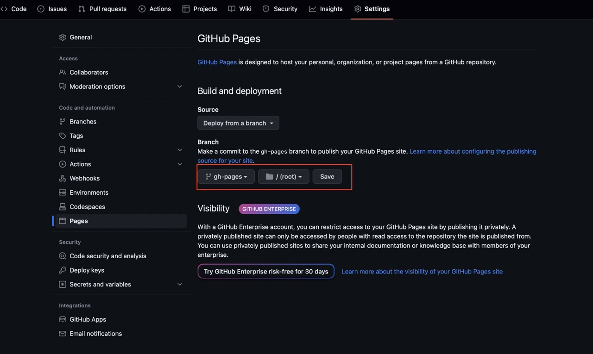

In our project we were searching for a documentation tool to distribute the product documentation to clients. Documentation tool had to support multiple languages (English, Japanese, ...) and documentation versioning. After some research we picked [Docusaurus](https://docusaurus.io/).

## Why Docusaurus?

- Free of cost and support GitHub pages out of the box
- Fast setup & wonderful documentation: [Fast track](https://docusaurus.io/docs#fast-track), [Detailed documentation](https://docusaurus.io/docs)
- No vendor lock, documentation is easy to write using [Markdown](https://www.markdownguide.org/getting-started/)
- Internationalization support
- Documentation versioning support
- Dark mode support
- Extendable using React components

See [comparison with other tools](https://docusaurus.io/docs#comparison-with-other-tools).

## First setup

Setup is described in [documentation](http://localhost:3000/docs/intro).

1. Install Node.js version 16.14 or above

2. Install Docusaurus

    ```bash
    npm init docusaurus@latest docusaurus-test classic
    ```

3. Run docusaurus

    ```bash
    cd docusaurus-test
    npm run start
    ```

4. Open browser at [http://localhost:3000/](http://localhost:3000/)

## Setup Japanese support

1. Remove all pages from `docs/`

    ```bash
    rm -r ./docs/*
    ```

2. Create a new page in `docs/intro.md`

      ```markdown
      ---
      sidebar_position: 1
      title: Hello World
      ---

      Hello World!

      ```

3. To add language select to navigation bar update `./docusaurus.config.js`

    ```diff
    ...
      i18n: {
        defaultLocale: 'en',
    -   locales: ['en'],
    +   locales: ['en', 'ja'],
      },
    ...
    themeConfig:
      ...
          navbar: {
          ...
            items: [
              {
                type: 'docSidebar',
                sidebarId: 'tutorialSidebar',
                position: 'left',
                label: 'Tutorial',
              },
    +         {
    +           type: 'localeDropdown',
    +           position: 'right'
    +         },
              ...
            ],
          },
          ...
    ```

4. Copy english pages to japanese

    ```bash
    mkdir -p i18n/ja/docusaurus-plugin-content-docs/current
    cp -r docs/** i18n/ja/docusaurus-plugin-content-docs/current
    ```

5. Translate japanese page at `./i18n/ja/docusaurus-plugin-content-docs/current/intro.md`

      ```markdown
      ---
      sidebar_position: 1
      title: Hello World
      ---

      ハロー・ワールド

      ```

6. To test Japanese pages locally run `npm run start -- --locale ja` (Only one language can be 'active' when running locally)

## Setup GitHub pages

Create a new GitHub repository and setup git.

```bash
git init -b develop
git remote add origin https://github.com/zzundalek/docusaurus-test.git
```

### Setup for GitHub pages

```diff
const config = {
  ...
- url: 'https://your-docusaurus-test-site.com',
+ url: 'https://zzundalek.github.io', // https://{your_github_user_name}.github.io

- baseUrl: '/',
+ baseUrl: '/docusaurus-test/', // /{your_repository_name}/

- organizationName: 'facebook',
+ organizationName: 'zzundalek', // {your_github_user_name}
- projectName: 'docusaurus',
+ projectName: 'docusaurus-test', // {your_repository_name}

+ trailingSlash: true,
  ...
}
```

### Setup deployment

1. Create a new file `.github/workflows/deploy.yml` for GitHub actions which will automatically build and deploy the page to `gh-pages` branch.

    ```yaml
    name: Deploy to GitHub Pages

    on:
      push:
        branches:
          - develop

    permissions:
      contents: write

    jobs:
      deploy:
        name: Deploy to GitHub Pages
        runs-on: ubuntu-latest
        steps:
          - uses: actions/checkout@v3
          - uses: actions/setup-node@v3
            with:
              node-version: 18
              cache: npm

          - name: Install dependencies
            run: npm ci
          - name: Build website
            run: npm run build

          - name: Deploy to GitHub Pages
            uses: peaceiris/actions-gh-pages@v3
            with:
              github_token: ${{ secrets.GITHUB_TOKEN }}
              publish_dir: ./build
              user_name: github-actions[bot]
              user_email: 41898282+github-actions[bot]@users.noreply.github.com
    ```

2. Push changes to the `develop` branch in GitHub. `gh-pages` branch should be automatically created.

3. Turn on GitHub pages for the repository and click `Save`.
    

4. Check the `GitHub pages` at `https://{your_github_user_name}.github.io/{your_github_repository_name}/`

## Docs only mode

### Turn off the blog

1. Disable blog at `./docusaurus.config.js`

    ```diff
    ...
    presets: [
      [
    + blog: false        
    - blog: {
    - ...
    - }
      ],
    ],
    ...
    ```

2. Remove blog from the navigation bar

    ```diff
    ...
    themeConfig:
      navbar: {
        items: [
          ...
    -     {to: '/blog', label: 'Blog', position: 'left'},
          ...
        ]
      }
    ...
    ```

### Turn off the pages

1. Remove page files from `./pages`

    ```bash
    rm -r ./src/pages/*
    ```

2. Set docs as default page

    ```diff
    ...
    presets: [
      {
        ...
        docs: {
    +     routeBasePath: '/',
          ...
        },
        ...
      },
    ],
    ...
    ```

3. Update `./docs/intro.md` and `./i18n/ja/docusaurus-plugin-content-docs/current/intro.md` to set it as default page

    ```diff
      ---
      sidebar_position: 1
      title: Hello World
    + slug: /
      ---
      ...
    ```

### Remove dead links from footer

We've disabled the blog and pages, but there are still active links to it. Docusaurus build will check the links and fails to build if there is any broken link.

```diff
footer: {
  style: 'dark',
  links: [
    {
      title: 'Docs',
      items: [
        {
          label: 'Tutorial',
-         to: '/docs/intro',
+         to: '/',
        },
      ],
    },
...
    {
      title: 'More',
      items: [
-       {
-         label: 'Blog',
-         to: '/blog',
-       },
        {
          label: 'GitHub',
          href: 'https://github.com/facebook/docusaurus',
        },
      ],
    },
  ],
  copyright: `Copyright © ${new Date().getFullYear()} My Project, Inc. Built with Docusaurus.`,
  },
```

## Setup versioning

1. Create a new tagged version from current version

    ```bash
    npm run docusaurus docs:version 1.0.0
    ```

2. Add version select to navigation bar

    ```diff
    themeConfig:
    ...
      navbar: {
        title: 'My Site',
        logo: {
          alt: 'My Site Logo',
          src: 'img/logo.svg',
        },
        items: [
          ...
    +      {
    +       type: 'docsVersionDropdown',
    +       position: 'right',
    +       dropdownActiveClassDisabled: true,
    +      },
          ...
        ],
      }

    ```
